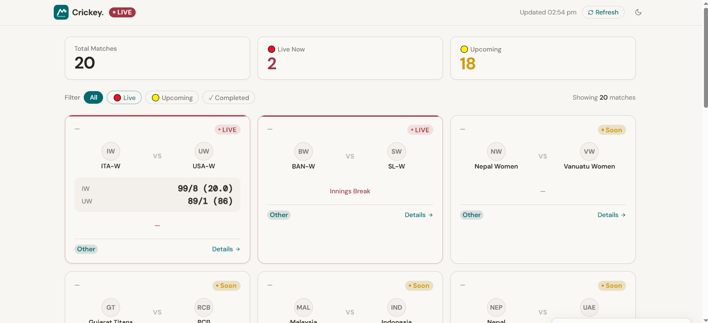
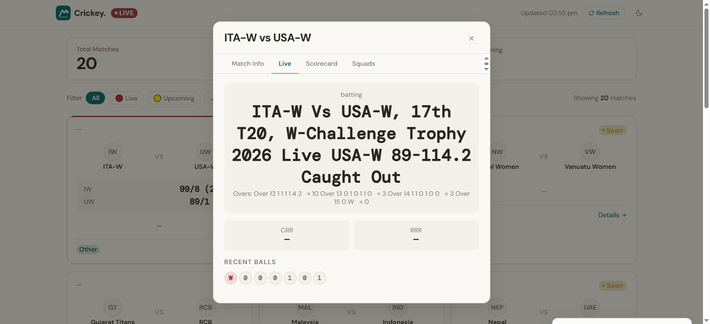
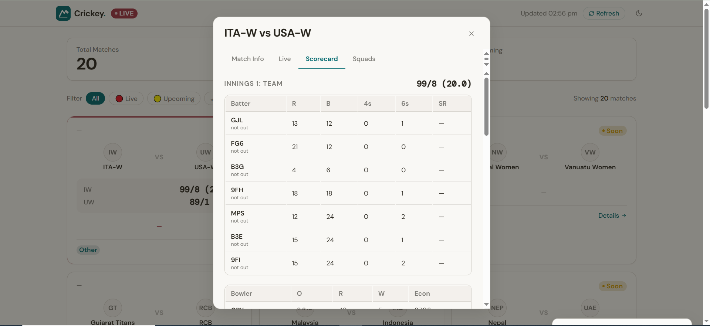

# Crickey 🏑

A production-grade **real-time cricket data scraping system** and dashboard for [CREX](https://crex.com).

Crickey monitors the live fixture list, auto-triggers individual match scrapers when matches start, and continuously polls **Live**, **Scorecard**, and **Match Info** data throughout each match. The collected data is stored as JSON and rendered in a sleek, static HTML dashboard.

---

## 📸 Screenshots

### Dashboard Overview


### Live Match Details


### Team Squads


---

## ✨ Features

- **Real-time Scraping:** Monitors and scrapes match data every 30-60 seconds.
- **Dynamic Dashboard:** A clean, responsive UI to view all matches (Live, Upcoming, Completed).
- **Match Details Modal:** Deep-dive into any match with 4 dedicated tabs:
    - **Match Info:** Venue, toss, umpires, and result.
    - **Live:** Real-time score, run rates, and recent ball-by-ball commentary.
    - **Scorecard:** Comprehensive batting and bowling statistics.
    - **Squads:** Playing XI and bench information.
- **Auto-Refresh:** The dashboard automatically updates every 30 seconds.
- **Dark Mode Support:** Full dark mode support for a premium feel.
- **Hybrid Scraping:** Uses Playwright for browser-based scraping with API interception for speed and reliability.

---

## 🛠️ How it Works

1. **Discovery:** `main.py` starts the `scheduler.py`, which polls the CREX fixture list.
2. **Scraping:** When a match is detected as live or starting soon, per-match workers are spawned to scrape:
    - `match_info.json`
    - `squads.json`
    - `live_latest.json`
    - `scorecard_latest.json`
3. **Storage:** Data is saved atomically in the `output/` directory, organized by `match_id`.
4. **Presentation:** `crickey-dashboard.html` fetches these JSON files and renders them using vanilla JavaScript.

---

## 🚀 Run Locally

### 1. Scrape Data
Ensure the scraper is running to generate the necessary JSON files:
```bash
python main.py
```

### 2. Launch Dashboard
Serve the project root using a local HTTP server:
```bash
python -m http.server 8080
```
Then open `http://localhost:8080/crickey-dashboard.html` in your browser.

---

## 📡 Current Status
- **UI Integration:** Fully operational on the `feature/ui-dashboard` branch.
- **Data Rendering:** Live cards and detailed scorecards now render dynamically from local JSON.
- **Reliability:** Hybrid API/DOM parsing ensures data availability even if CREX updates its UI.

---

## Output Structure

```
output/
  schedule.json                    ← full fixture list snapshot
  {match_id}/
    match_info.json                ← venue, toss, umpires, result
    squads.json                    ← playing XI for both teams
    live_latest.json               ← most recent live snapshot
    scorecard_latest.json          ← most recent scorecard
    live/
      20260429T123000Z.json        ← timestamped live history
      20260429T123030Z.json
      ...
    scorecard/
      20260429T123000Z.json        ← timestamped scorecard history
      ...
```

### Sample `match_info.json`

> Full sample: [`sample_output/match_info_sample.json`](sample_output/match_info_sample.json)

```json
{
  "match_id": "nep-vs-oma-100th-match-mens-cwc-league-2-2023-27-match-updates-11HD",
  "series": "CWC League-2 2023-27",
  "match_number": "100",
  "venue": "Tribhuvan University International Cricket Ground",
  "city": "Kirtipur",
  "date": "Wednesday, 29 April, 9:15 AM",
  "start_time_utc": "2026-04-29T03:45:00Z",
  "toss": "OMA won the toss and elected to bat",
  "umpires": ["Umpire Name 1", "Umpire Name 2"],
  "result": "Rain Stops Play"
}
```

### Sample `scorecard_latest.json`

> Full sample: [`sample_output/scorecard_sample.json`](sample_output/scorecard_sample.json)

```json
{
  "match_id": "nep-vs-oma-...",
  "is_partial": false,
  "innings": [
    {
      "innings_number": 1,
      "batting_team": "Oman",
      "total": "305/8",
      "overs": "50.0",
      "batting": [
        { "player": "Aqib Ilyas", "runs": 83, "balls": 92, "fours": 7, "sixes": 2 }
      ],
      "bowling": [
        { "player": "Sagar Pun", "wickets": 3, "overs": 10.0, "runs": 52, "economy": 5.2 }
      ],
      "extras": { "wides": 6, "no_balls": 2, "byes": 3, "leg_byes": 1, "total": 12 }
    }
  ]
}
```

### Sample `live_latest.json`

> Full sample: [`sample_output/live_sample.json`](sample_output/live_sample.json)

```json
{
  "match_id": "nep-vs-oma-...",
  "status_text": "In Progress",
  "current_score": "205/4",
  "current_overs": "38.3",
  "run_rate": 5.33,
  "required_run_rate": 7.81,
  "interruption_reason": null,
  "batters_on_crease": [
    { "player": "Rohit Paudel",   "runs": 55, "balls": 60, "strike_rate": 91.7 },
    { "player": "Dipendra Airee", "runs": 18, "balls": 22, "strike_rate": 81.8 }
  ],
  "current_bowler": { "player": "Bilal Khan", "wickets": 2, "overs": 7.3, "runs": 31 },
  "recent_balls": [
    { "over": "38.3", "runs": 4, "is_boundary": true, "commentary": "FOUR! drives through covers" }
  ]
}
```

### Sample `squads.json`

> Full sample: [`sample_output/squads_sample.json`](sample_output/squads_sample.json)

---

## Setup

### Prerequisites
- Python 3.10+
- Git

### Install

```bash
git clone <your-repo-url>
cd crickey

python -m venv venv
venv\Scripts\activate      # Windows
# source venv/bin/activate  # Linux/Mac

pip install -r requirements.txt
playwright install chromium
```

### Environment Variables

Copy `.env.example` to `.env` and adjust values if needed:

```bash
cp .env.example .env
```

---

## Usage

### Full scheduler (recommended)
Monitors the match list and auto-triggers live/scorecard polling when matches start.

```bash
python main.py
```

### Single poll (fetch match list once and exit)

```bash
python main.py --once
```

### Scrape a specific match

```bash
# All tabs
python main.py --match "ind-vs-aus-1st-odi-abc123"

# Specific tabs
python main.py --match "ind-vs-aus-1st-odi-abc123" --tabs info squads
python main.py --match "ind-vs-aus-1st-odi-abc123" --tabs scorecard live
```

### UI Dashboard Integration

The frontend UI integration is maintained on the `feature/ui-dashboard` branch. It provides a production-ready static HTML dashboard that dynamically reads the scraped JSON output via HTTP.

To run the dashboard:
1. Ensure you have run the scraper to generate data in the `output/` directory.
2. Serve the project root locally:
```bash
python -m http.server 8080
```
3. Open `http://localhost:8080/crickey-dashboard.html` in your browser.

The frontend natively handles data normalization, auto-refreshing every 30 seconds, and gracefully falling back when parts of the data are missing. It connects directly to `output/schedule.json` and fetches `match_info`, `live_latest`, `scorecard`, and `squads` dynamically.

---

## Running Tests

```bash
python -m pytest tests/ -v
```

Or run the output validator manually after a scrape:

```bash
# Check schedule only
python -m pytest tests/test_output.py -v

# Check a specific match's output
python tests/test_output.py <match-slug>
```

---

## Configuration

All tuneable constants are in `config.py` (see `.env.example` for environment overrides):

| Constant | Default | Description |
|---|---|---|
| `SCHEDULE_POLL_INTERVAL` | 300s | How often to refresh the fixture list |
| `LIVE_POLL_INTERVAL` | 30s | How often to poll live score during a match |
| `SCORECARD_POLL_INTERVAL` | 60s | How often to poll scorecard during a match |
| `PRE_WARM_SECONDS` | 120s | Start polling this many seconds before kick-off |
| `MAX_CONCURRENT_PAGES` | 3 | Max simultaneous Playwright pages |
| `HEADLESS` | True | Run browser without UI |
| `MAX_RETRIES` | 3 | Retry attempts before giving up |

---

## Design Decisions & Tradeoffs

| Decision | Rationale |
|---|---|
| **Playwright over requests** | CREX requires JS execution (Angular SPA) |
| **API interception > DOM parsing** | Raw JSON is faster, more reliable, schema-stable |
| **APScheduler (not Celery)** | No Redis/broker needed; single-process asyncio |
| **Pydantic v2 models** | Schema validation catches malformed data at parse time |
| **Atomic file writes** | `tmp → os.replace()` prevents corrupt JSON on process kill |
| **Semaphore(3 pages)** | Caps memory/CPU while allowing concurrency |
| **Per-match timestamped files** | Full audit trail; `latest.json` for quick access |
| **Squads from /match-details DOM** | `/match-squads` URL renders a blank page on CREX |
| **Crash recovery state file** | `output/.scheduler_state.json` persists job registry across restarts |

> Full design rationale and future optimisation plan: **[DESIGN.md](DESIGN.md)**

---

## Edge Cases Handled

- ✅ **TBD matches** — `start_time` stored as `null`
- ✅ **Squad not announced** — `announced: false`, empty player lists
- ✅ **Test matches** — multiple innings (innings array)
- ✅ **Super Over** — detected as separate innings (`is_super_over: true`)
- ✅ **DLS applied** — `dls_target` field captured
- ✅ **Rain / DLS / Delay** — `interruption_reason` field set on `LiveScore`
- ✅ **Abandoned / No Result** — status mapped, final scrape still runs
- ✅ **All times in UTC** — epoch ms from `getSV3["mt"]` converted to ISO 8601
- ✅ **Status text from API** — `getSV3["B"]` carries human-readable text (e.g. "Rain Stops Play")
- ✅ **Page load timeout** — retried with exponential back-off
- ✅ **API response unavailable** — automatic DOM fallback
- ✅ **Runaway pollers** — jobs cancelled immediately on match completion
- ✅ **Process killed mid-write** — atomic writes prevent corruption
- ✅ **Scheduler crash recovery** — `output/.scheduler_state.json` restored on restart

---

## Project Structure

```
crickey/
├── main.py              # Entry point & CLI
├── scheduler.py         # Job lifecycle orchestrator
├── config.py            # All constants
├── requirements.txt
├── .env.example         # Environment variable template
├── DESIGN.md            # Architecture decisions & follow-up Q&A
├── scraper/
│   ├── browser.py       # Playwright browser pool
│   ├── interceptor.py   # Network API capture
│   ├── match_list.py    # Fixture list scraper
│   └── match_detail.py  # Per-tab match scrapers
├── models/
│   └── match.py         # Pydantic v2 data schemas
├── storage/
│   └── json_store.py    # Atomic JSON persistence
├── utils/
│   ├── logger.py        # Loguru structured logging
│   ├── retry.py         # Exponential back-off decorator
│   └── time_utils.py    # Timezone-aware date parsers
├── tests/
│   ├── __init__.py
│   └── test_output.py   # Output quality validator
└── output/              # Auto-created scraped data (git-ignored)
```
